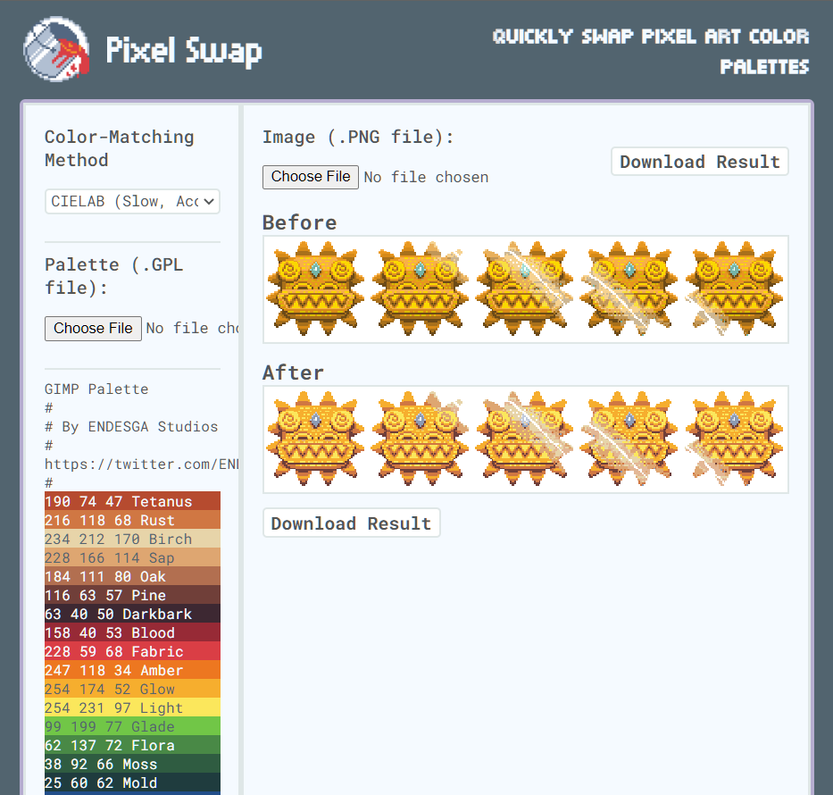

# Pixel Swap

Select an image. Select a color palette. Convert colors like magic. Try it here: [pixelswap.art](https://pixelswap.art).

  

## Instructions

Pixel Swap is a small web application that swaps the colors of an image with the closest color from the selected palette. Here's how to use it:

1. Select the color-matching method.

- Euclidean distance is the fastest. CIELAB is closest to how the human eye perceives differences in color in real life.
- None of the methods take into account aesthetics or style, so often the "right" method for your conversion is a matter of personal choice.

2. Select the image.

- Must be a .PNG file.
- Alpha values won't be affected.
- Large images will take longer to convert; performance is machine-dependent because the application runs client-side.
- I would recommend images under 2000x2000px, but you can exceed this limit.

3. Select the color palette.

- Must be a .GPL file ([GIMP Color Palette](https://docs.gimp.org/2.10/en/gimp-concepts-palettes.html)).
- You can find a collection of color palettes here: https://lospec.com/palette-list. Download as GIMP .GPL.
- There is minimal validation for color palettes. Please ensure the file you give the application is well-formatted.

4. Download the image by clicking the converted picture or the "Download Result" button.

## How

Pixel Swap converts an image's colors by comparing each pixel to every color in the selected palette. The color-by-color difference is calculated using the same method for every pixel in the image, but you can change the method to automatically recalculate the result. There are three possible methods:

1. Euclidean Distance

- The difference between two colors is calculated by representing them as two points in 3D space, then calculating the distance between them [[1](#ref1)].
- For both colors, let X = R, Y = G, and Z = B. Then, calculate the euclidean distance between the two resulting points. Shorter distances indicate smaller differences in color.

2. Weighted RGB

- Identical to Euclidean Distance, except the individual difference in color is weighted differently for red, green, and blue.
- I used 0.3 for red, 0.59 for green, and 0.11 for blue [[1](#ref1)].

3. CIELAB

- The difference between two colors is equal to their difference in the CIE-L\*ab color space.
- If the colors are represented in RGB, they must first be converted into the XYZ color format, and then into CIE-L\*ab [[2](#ref2)].
- CIE-L\*ab color conversion depends on several constant reference values; my conversion is based on the D50 illuminant with a 2° (CIE 1931) observer because I read that they are commonly used.

Pixel Swap was originally written in JavaScript, then translated into C++ and compiled into WebAssembly to improve performance. To view the source code, visit the [app](./app/) folder.

### References and Acknowledgements

1. Baeldung. "How to Compute the Similarity of Colours," https://www.baeldung.com/cs/compute-similarity-of-colours.
2. EasyRGB. "Color math and programming code examples," http://www.easyrgb.com/en/math.php.

This application is hosted at [pixelswap.art](https://pixelswap.art) for free via [Netlify](https://www.netlify.com/).
